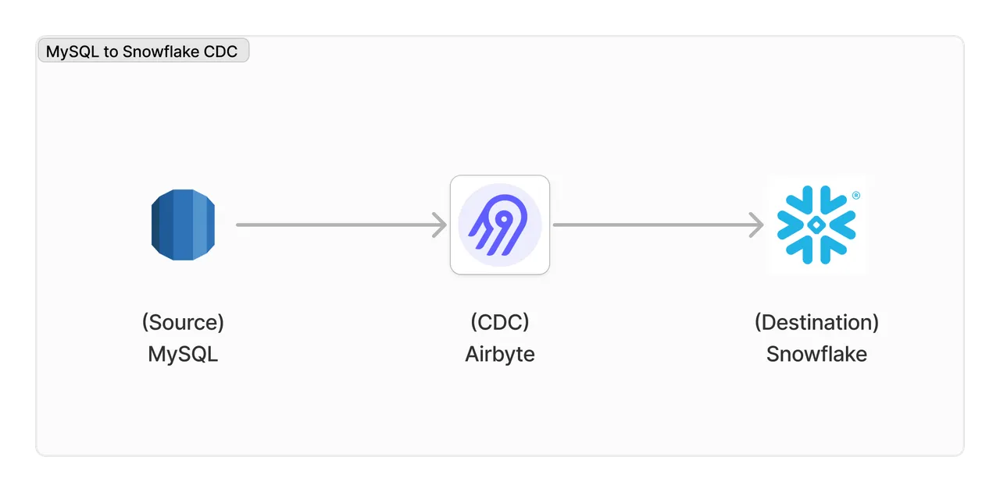

# Airbyte를 사용하여 MySQL to Snowflake 연결 시 고려 사항

## 개요

EC2 내부에 docker-compose를 사용하여 Airbyte를 생성하고, Source는 AWS RDS 위에 운영되는 MySQL, Destination은 Snowflake로 각각 커넥터 설정을 하였습니다. 환경을 구성 후 CDC를 진행하며 겪었던 상황과 해결 방법을 작성하였습니다.

---

## 1. MySQL에서 1억건 이상의 테이블에 대한 초기 마이그래이션 시 리소스 고려

Airbyte는 CDC 이전 초기 연결 시 테이블에 대해 Source에서 Destination으로 마이그래이션을 진행합니다. 마이그래이션 시 RDS 리소스도 중요하지만 EC2 리소스를 더 많이 사용합니다. RDS는 Task 당 커넥션을 하나만 사용하지만, EC2는 돌아가고 있는 모든 Task들을 관리해야 하기 때문입니다.

1억건 이상 테이블 당 마이그래이션 시 RDS 리소스는 db.m6i.2xlarge 기준 CPU 점유율이 2% 정도 상승하였습니다. 반면 EC2는 c7i.4xlarge 기준 CPU 점유율이 20% 되었습니다. 그래서 EC2 c7i.4xlarge 기준 1억건 이상 테이블을 5개 이상 한번에 적재하는 경우 CPU 리소스가 부족할 수 있습니다. 그래서 초기 마이그래이션 시 테이블 하나당 EC2 c7i.xlarge 기준으로 생각하여 고려하고 있는 병렬 처리 테이블 개수만큼 인스턴스 크기를 늘려서 짧은 시간에 마이그래이션을 완료할 수 있도록 합니다. CPU 리소스가 부족한 경우, Sync 과정에서 중지가 될 수 있으며 지금까지 받은 데이터를 모두 날리고 새로 받아야 하는 경우도 생길 수 있습니다.

---

## 2. CDC를 위한 RDS MySQL 설정 수정

시스템에서 사용하는 DB에는 별도 설정없이 기본값으로 사용하는 경우가 있습니다. 그런 경우 MySQL에서 복제, 동기화 등의 목적으로 사용하는 `binlog` 에 대한 설정도 기본값인 경우가 대부분입니다.

binlog 설정 시 확인했던 부분은 다음과 같습니다.

* binlog 확인: `SHOW binary logs;`
* RDS 내부 설정 확인: `CALL mysql.rds_show_configuration;`

설정 확인 후 MySQL에서 binlog를 수정한 내용은 다음과 같습니다.

* RDS 파라미터 그룹 수정
  * RDS 파라미터 그룹은 MySQL 중지없이 설정 변경 시 즉시 적용되어 binlog 관련 설정을 운영에 지장없이 변경할 수 있었습니다.
  * binlog\_format: MIXED -> ROW (CDC Required)
  * binlog\_row\_image: null(full) -> full (CDC Required)
* MySQL 내부에서 프로시저 실행
  * 해당 프로시저 또한 MySQL 중지없이 실행으로 설정을 변경할 수 있었습니다.
    * `CALL mysql.rds_set_configuration('binlog retention hours', 25);`
      * binlog에 대한 retention 시간을 25시간으로 두었기 때문에, 25시간 이상 간격이 필요한 CDC에는 설정값을 높힐 필요가 있습니다.

---

## 3. 초기 MySQL에서 Snowflake 테이블 적재 시 대략적인 소요 시간

적재하는 Source나 Destination의 종류, Airbyte가 서비스되는 플랫폼의 종류 및 인프라 제원 등에 따라서 마이그래이션 시간은 상이할 수 있습니다. 이 부분을 참고하셔서 대략적으로 참고하실 수 있도록 테이블 마이그래이션 및 CDC 결과 공유드립니다.

#### 공통 사항

* EC2 인스턴스 크기: c7i.4xlarge

#### 테이블 1

* 용량: 226.8GB
* ROW: 약 430,000,000 (430M)
* 마이그래이션 시간: 약 7시간
* CDC 시간: 평균 4\~5만 Row 당 4분 소요
* CDC 시 12\~13% 소모

#### 테이블 2

* 용량: 31.7GB
* ROW: 약 42,000,000
* 마이그래이션 시간: 약 48분