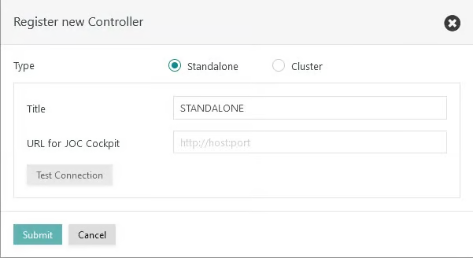
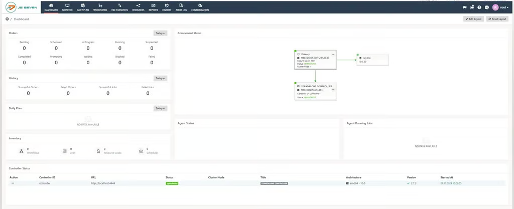
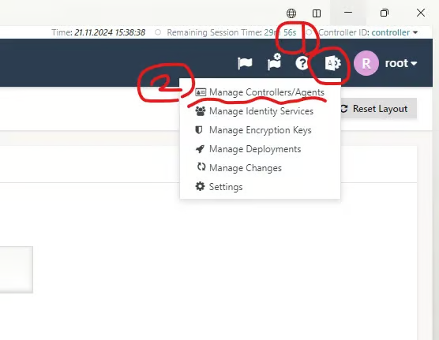
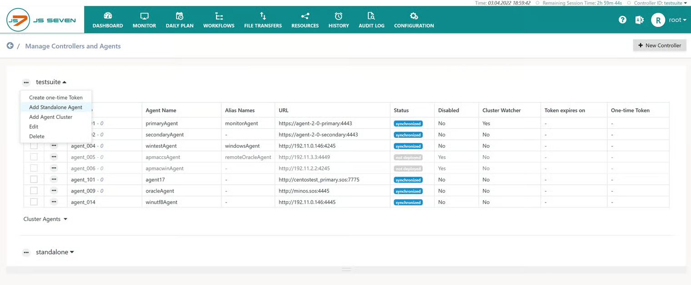
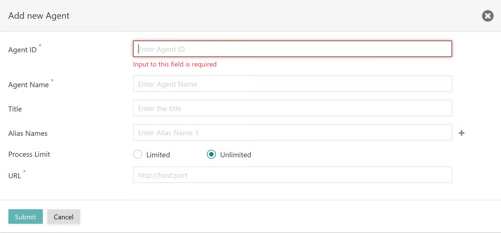

# JS7 JobScheduler Controller and Agent 초기 접속 설정(w/ docker-compose)

## 로그인 및 Controller 설정

1. [http://localhost:4446/joc/#/login](http://localhost:4446/joc/#/login) 로 접속합니다.
2. ID, PW
   1. ID: root
   2. PW: root
3. 접속 후 비밀번호 변경 창이 나오고 변경 진행
4. Controller URL를 설정하는 창이 나오는데 `URL for JOC Cockpit`에 `http://{controller-docker-name}:4444` 로 작성합니다.
   1. 클러스터 옵션을 사용하려면 라이센스가 필요합니다.
   2. `docker ps` 를 실행하여 컨테이너 이름를 확인하고, URL에 기입합니다.
      1. ex) http://js7-controller-primary-1:4444

5. 접속되며 메인 화면이 나옵니다.

---

## Agent 설정

1. 1시 방향에 있는 설정 아이콘 > `Manage Controllers/Agents` 를 클릭합니다.

2. Controller 옆에 있는 `…` 을 클릭 후 `Add Standalone Agent` 를 클릭합니다.

3. 팝업 창이 표시되며 각 항목들을 입력합니다.

* `Agent ID`
  * 에이전트의 고유 식별자입니다. 고유성은 동일한 컨트롤러에 등록된 모든 에이전트에 적용됩니다. 이 식별자는 나중에 변경할 수 없습니다.
* `Agent Name`
  * 에이전트의 이름은 예를 들어 에이전트를 작업에 할당할 때 사용됩니다. _에이전트 ID_ 와 마찬가지로 에이전트 _이름은_ 고유해야 하지만 나중에 변경할 수 있습니다.
* `Title`
  * 검색이 가능한 개별 설명입니다.
* `Alias Names`
  * 동일한 에이전트를 다른 이름으로 사용할 수 있습니다. 이는 서로 다른 _에이전트 이름을_ 작업에 할당해야 하는 경우 유용할 수 있습니다. 예를 들어, 프로덕션 환경에서 더 많은 에이전트를 사용하여 비프로덕션 환경에서 더 적은 수의 에이전트에 매핑하는 경우입니다.
* `Process Limit`
  * 에이전트는 무제한의 병렬 프로세스를 실행할 수 있습니다. 사용자는 병렬 프로세스를 제한하여 서버 리소스가 고갈되는 것을 방지하고 다음 프로세스가 사용 가능할 때까지 주문을 기다리게 할 수 있습니다.
* `URL`
  * 에이전트가 컨트롤러에 접근할 수 있는 프로토콜(HTTP 또는 HTTPS), 호스트 이름 또는 IP 주소 및 포트입니다.
  * `http://{agent-docker-name}:4445` 형식으로 작성합니다.
    * ex) http://js7-agent-primary-1:4445

## Reference

* https://qiita.com/saitamanokusa/items/ffb8f05cbc8e75d435ce
